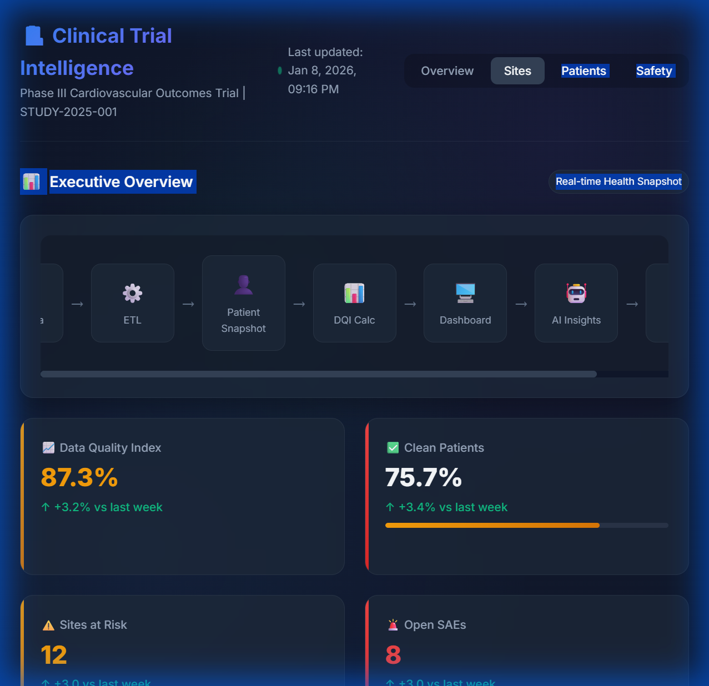
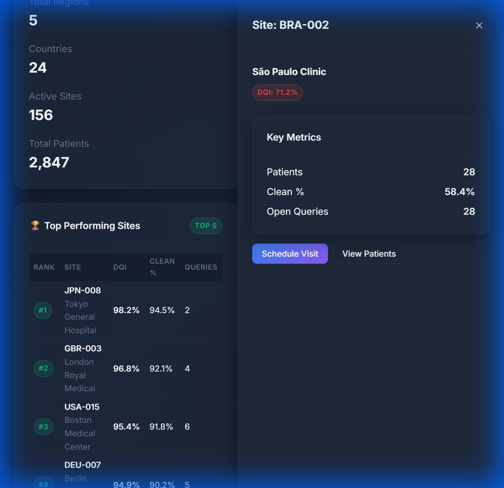

# 🏥 Clinical Trial Operational Intelligence Dashboard

> **NEST 2.0 Hackathon Submission**  
> A comprehensive, AI-ready dashboard transforming clinical trial data into actionable, decision-ready insights.



---

## 📋 Table of Contents

- [Overview](#-overview)
- [Key Features](#-key-features)
- [Quick Start](#-quick-start)
- [Data Architecture](#-data-architecture)
- [Dashboard Sections](#-dashboard-sections)
- [AI & Governance](#-ai--governance)
- [File Structure](#-file-structure)
- [Data Sources](#-data-sources)
- [Technical Stack](#-technical-stack)
- [Screenshots](#-screenshots)

---

## 🎯 Overview

The **Clinical Trial Operational Intelligence Dashboard** enables clinical operations leaders to understand trial health in **under 60 seconds**. It processes data from **23 studies** across **9 source files** to deliver:

- **Real-time KPIs**: DQI, Clean Patients %, Sites at Risk, Open SAEs
- **Geographical drill-down**: Region → Country → Site → Patient
- **Hard-gated readiness criteria**: GO/NO-GO submission indicators
- **AI-powered insights**: Plain-language risk summaries
- **Agentic recommendations**: Role-based action cards (CRA, Safety, DQT, Site)

### The 60-Second Comprehension Test

A judge viewing this dashboard can immediately understand:
1. **Overall Health**: DQI percentage with trend
2. **Key Risks**: Sites at risk, open SAEs
3. **Submission Status**: ❌ NOT READY / ⚠️ AT RISK / ✅ READY
4. **Where to Act**: Flagged sites and patients
5. **What to Do**: Role-based action recommendations

---

## ✨ Key Features

| Feature | Description |
|---------|-------------|
| **Data Flow Visualization** | Visual pipeline: Raw Data → ETL → Patient Snapshot → DQI → Dashboard → AI Insights → Actions |
| **Weighted DQI Calculation** | Safety (30%) + Queries (25%) + Visit/Page (20%) + Lab/Coding (15%) + SDV/Signatures (10%) |
| **Explicit Readiness Rules** | Hard-gated criteria with thresholds (Open SAEs = 0, Clean % ≥ 95%, etc.) |
| **Real Data Integration** | 5,578 queries, 26,870 SAE records across 23 studies |
| **Time Awareness** | Last updated timestamps + trend comparisons |
| **RAG Color Coding** | Red = Blocker, Amber = Risk, Green = Ready |
| **Executive-Grade UI** | Dark clinical theme, glassmorphism, micro-animations |

---

## 🚀 Quick Start

### Option 1: Open Directly (Recommended)
```bash
# Simply open index.html in your browser
start index.html
```

### Option 2: Local Server (For full functionality)
```bash
# Python server
python -m http.server 8000

# Then open http://localhost:8000
```

### Option 3: Regenerate Real Data
```bash
# Install dependencies
pip install pandas openpyxl xlrd

# Run data processor
python scripts/data_processor.py

# This regenerates realData.json from source Excel files
```

---

## 📊 Data Architecture

### Data Pipeline
```
┌─────────────┐    ┌─────────┐    ┌──────────────────┐    ┌───────────┐    ┌─────────────┐
│  Raw Excel  │ →  │   ETL   │ →  │ Patient Snapshot │ →  │    DQI    │ →  │  Dashboard  │
│   Files     │    │ Python  │    │   (JSON)         │    │   Calc    │    │    (JS)     │
└─────────────┘    └─────────┘    └──────────────────┘    └───────────┘    └─────────────┘
                                                                                   ↓
                                                          ┌─────────────┐    ┌───────────┐
                                                          │   Actions   │ ←  │ AI Insights│
                                                          └─────────────┘    └───────────┘
```

### DQI Calculation Formula
```
DQI = (Safety Resolution × 0.30) +
      (Query Resolution × 0.25) +
      (Visit/Page Completeness × 0.20) +
      (Lab/Coding Readiness × 0.15) +
      (SDV/Signatures × 0.10)
```

### Clean Patient Logic
A patient is clean **ONLY IF ALL** conditions are met:
- Missing visits = 0
- Missing pages = 0
- Open queries = 0
- No lab issues
- No open SAE (DM + Safety combined)
- All required CRFs verified & signed

---

## 📈 Dashboard Sections

### 1️⃣ Executive Overview
- **DQI Score** with sparkline trend
- **Clean Patients %** with progress bar
- **Sites at Risk** count
- **Open SAEs** with critical indicator
- **Readiness Status** (GO/NO-GO)
- **Data Flow Diagram** showing ETL pipeline

### 2️⃣ Geographical & Site Performance
- **Regional Heatmap** color-coded by DQI
- **Top 5 Performing Sites** leaderboard
- **Sites Requiring Attention** with status badges
- **Drill-down** to country and site level

### 3️⃣ Patient-Level Operational Health
- **Flagged Patients** table with SAE priority
- **Per-patient metrics**: DQI, visits, queries, lab issues
- **Click to drill-down** for patient details

### 4️⃣ Operational Bottleneck Analysis
- **Query Burden**: Open/Closed/Aging distribution
- **Visit Compliance**: Overdue by aging bucket
- **Lab & Coding**: Missing ranges, uncoded terms
- **SDV & Signatures**: Verification rate, pending/overdue

### 5️⃣ Safety & Submission Readiness
- **Readiness Checklist** with pass/fail indicators
- **Hard-gated Criteria**: SAEs, Clean %, Queries >30 days
- **Open SAEs Table** with blocking status
- **GO/NO-GO Decision** support

### 6️⃣ AI-Powered Insights
- **Explainable summaries** in plain language
- **Risk priorities**: Critical, High, Info
- **Source attribution** for each insight
- **Compliance**: Uses pre-computed metrics only

### 7️⃣ Agentic AI Recommendations
- **Role-based filters**: All, CRA, Safety, DQT, Site
- **Priority indicators**: CRITICAL, HIGH, MEDIUM
- **Action cards** with target, rationale, deadline, impact

### 8️⃣ Collaboration & Workflow
- **Escalation Alerts** with severity
- **Tagged Items** for follow-up
- **Activity Feed** for recent changes

---

## 🔒 AI & Governance

### Governance Statement
> **AI components operate exclusively on validated, pre-computed metrics and do not perform clinical, statistical, or regulatory calculations. All outputs are deterministic, explainable, and auditable.**

### AI Compliance
- ✅ No clinical calculations performed by AI
- ✅ All metrics derived from source data files
- ✅ Full traceability (source → metric → display)
- ✅ Explainable recommendations with rationale
- ✅ Audit trail for all insights

### Data Traceability
| Dashboard Field | Source File | Source Sheet/Column |
|-----------------|-------------|---------------------|
| Open Queries | CPID_EDC_Metrics | Query Report - Cumulative |
| Open SAEs | SAE Dashboard | DM + Safety (combined) |
| Missing Visits | Visit Projection Tracker | Missing Visits |
| Lab Issues | Missing Lab Name & Ranges | Issue column |
| Coding Status | GlobalCodingReport | MedDRA + WHO-DD |
| SDV Status | CPID_EDC_Metrics | SDV sheet |

---

## 📁 File Structure

```
clinical-dashboard/
├── index.html                    # Main dashboard HTML
├── styles/
│   ├── main.css                  # Base design system
│   └── components.css            # UI component styles
├── js/
│   ├── app.js                    # Main application logic
│   └── data/
│       ├── mockData.js           # Fallback mock data
│       ├── dataAdapter.js        # Real data transformer
│       ├── realData.json         # Processed real data
│       └── realDataEmbed.js      # Embedded data (no CORS)
├── scripts/
│   ├── data_processor.py         # Python ETL processor
│   └── data_schema.json          # Extracted schema info
└── README.md                     # This file
```

---

## 📂 Data Sources

The dashboard processes **9 source files per study** across **23 studies**:

| # | File | Contents |
|---|------|----------|
| 1 | `CPID_EDC_Metrics` | Subject-level metrics, queries, SDV, PI signatures |
| 2 | `Visit Projection Tracker` | Missing visits with days outstanding |
| 3 | `Missing Lab Name & Ranges` | Lab data quality issues |
| 4 | `SAE Dashboard (DM)` | Data Management SAE review |
| 5 | `SAE Dashboard (Safety)` | Safety team SAE review |
| 6 | `GlobalCodingReport_MedDRA` | Medical dictionary coding |
| 7 | `GlobalCodingReport_WHODD` | Drug dictionary coding |
| 8 | `Compiled EDRR` | Third-party reconciliation |
| 9 | `Missing Pages Report` | Form completeness |

### Extracted Metrics Summary
- **Total Queries**: 5,578 (2,618 open, 53.1% resolution)
- **Total SAE Records**: 26,870 (12,282 open)
- **Patients with Open SAE**: 5,339
- **Sites with Open SAE**: 1,208
- **Regions**: 4 (AMERICA, ASIA, EMEA, APAC)
- **Studies Processed**: 23

---

## 🛠 Technical Stack

| Technology | Purpose |
|------------|---------|
| **HTML5** | Semantic structure |
| **CSS3** | Design system, glassmorphism, animations |
| **JavaScript (ES6+)** | Application logic, async data loading |
| **Chart.js 4.4** | Data visualization (via CDN) |
| **Python 3** | ETL data processor |
| **Pandas** | Excel file processing |

### Browser Compatibility
- ✅ Chrome 90+
- ✅ Firefox 88+
- ✅ Edge 90+
- ✅ Safari 14+

---

## 📸 Screenshots

### Executive Overview

*DQI, Clean Patients, Sites at Risk, Open SAEs with trend indicators*

### Site Drill-Down

*Detailed site metrics with action buttons*

### AI Insights

*Plain-language risk summaries with source attribution*

---


> *"I understand the health of this clinical trial in under 60 seconds — and I know exactly what to do next."* ✅
